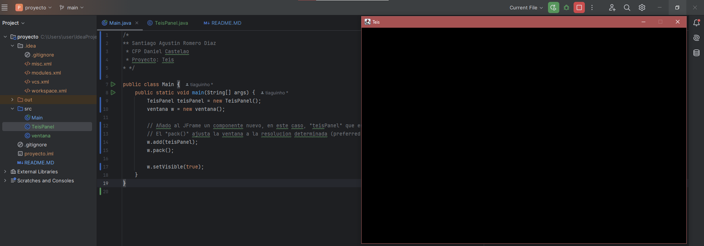
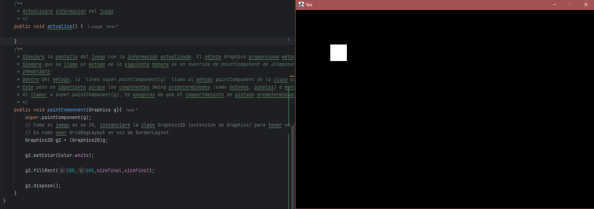
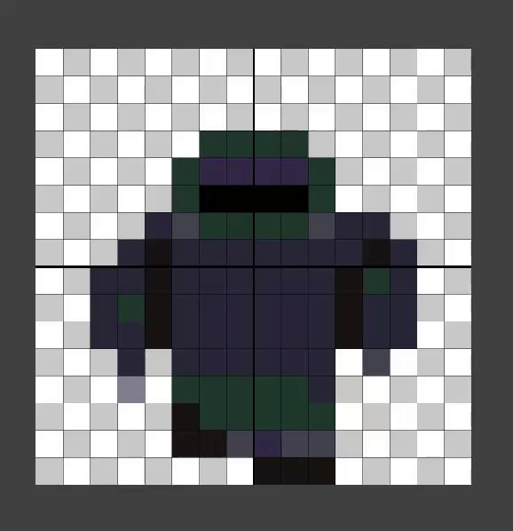
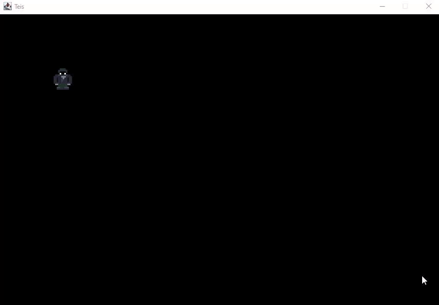
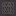
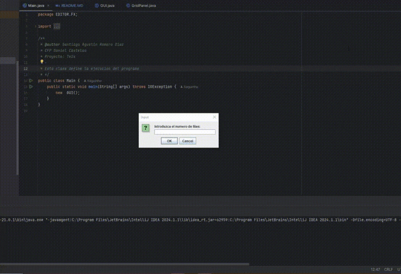
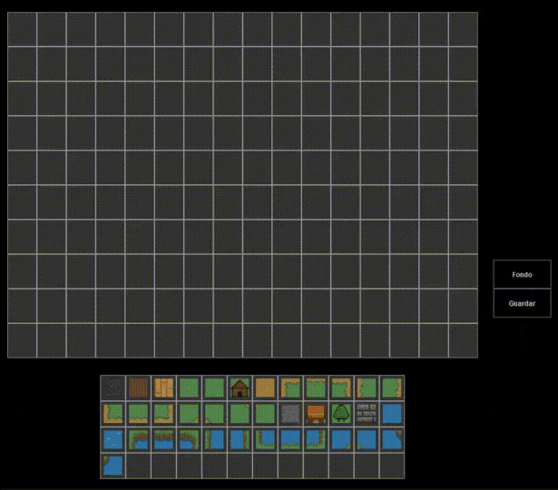
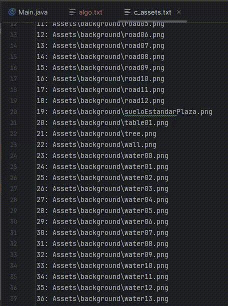
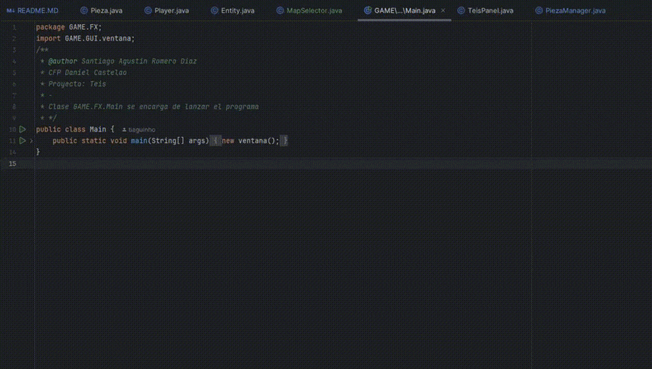

# Índice

- [Introducción](#notas-de-desarrollo)
- [Registro por semanas](#registro-semanal)
1. [Semana 1](#semana-del-06052024) 
   1. [Game Loop](#qué-es-un-game-loop)
   2. [¿Por qué es importante?](#por-qué-es-importante-el-bucle-de-juego)
   3. [Animaciones de personaje](#implementación-de-sprites-hechos-con-pixel-studio)
2. [Semana 2](#semana-del-13052024)
   1. [Editor de mapa](#editor-de-mapas-con-sprites)
   2. [Mejoras generales](#mejoras-generales)
   3. [Interpretador de mapa](#interpretador-de-mapa)
3. [Semana 3](#semana-del-20052024)
   1. [Desarrollo de centrado de cámara](#desarrollo-de-centrado-de-cámara)
   2. [Implementación de nuevos sprites](#implementación-de-nuevos-sprites)
   3. [Colisiones y diálogos](#implementacion-de-colisiones-y-dialogos)
4. [Semana 4](#semana-del-27052024)
___
# Notas de desarrollo

### En este documento estaré escribiendo los avances y registrandolos en una linea de tiempo

De esta manera tendré una visión más clara de como está avanzando el proyecto, intentaré estilizar este documento de la mejor manera posible para que sea comprensible, útil y simple.
Dicho esto, los objetivos de estas primeras semanas de desarrollo será investigar y programar los siguientes objetivos:
```
1. Un game loop.
2. Mostrar por pantalla al jugador.
3. Mostrar por pantalla el entorno.
4. Mostrar por pantalla objetos.
5. Controlar al jugador.
6. Programar las interacciones.
7. Implementar una base de datos
```
Para esto emplearé ***assets ya creados*** y, de ser necesario, modificaré los assets para adaptarlos a mi juego.
___
### ¿De qué va el juego (Teis)?

Mi idea es intentar desarrollar un juego en el que se pueda interactuar con varios objetos y personajes de un mismo mapa, dependiendo de como vaya el desarrollo,
implementaré otro mapa más allá del básico de inicio.
Este juego quiero que esté en Gallego y satirice un poco de los **"memes"** gallegos y de Vigo.
___
# Registro semanal
## Semana del 06/05/2024

*Definición de las propiedades de la pantalla mostrada al iniciar el juego:*
```java
//Propiedades pantalla
    private static final int maxScreenColumnas = 18;
    private static final int maxScreenFilas = 12;
    //Ancho y alto (uso valores mínimos por facilidad)
    private static final int screenWidth = TamañoFinal * maxScreenColumnas;
    private static final int screenHeight =  TamañoFinal * maxScreenFilas;


    public TeisPanel() {
        setPreferredSize(new Dimension(screenWidth,screenHeight));
        setBackground(Color.black);
        setDoubleBuffered(true);
    }
```

**Resultado:**


___
### Por otra parte...

1. Se crea un ***Issue*** y se relaciona al `PROJECT` creado en GitHub.
2. Se crea un *WebHook* con *Discord* para automatizar las actualizaciones del codigo como Logs a un canal de discord.
3. Se comienza a implementar el **Game Loop** en la rama *``ISSUE-1``*.
___
### ¿Qué es un Game Loop?

En desarrollo de `videojuegos` se conoce al "bucle principal del juego" o "Game Loop" como algo **increiblemente** fundamental:
Imagina que estás jugando a tu videojuego favorito. `Corres, saltas, esquivas enemigos y completas misiones.` Bien, pues *todo* esto está siendo posible gracias al _**Game Loop**_.

Pues volviendo a la pregunta principal, **qué es un Game Loop?**
Es la _base_ de la jugabilidad de un videojuego. Se trata de un ciclo que se repite constantemente mientras el juego está en funcionamiento, ``controlando el desarrollo de la partida y la experiencia del jugador``.
___
### ¿Cómo funciona el bucle de juego?
| Fases del bucle | Descripción                                                                                                                                                                                                                                                                          |                                                                                                                                                                                                                                                                        
|-----------------|--------------------------------------------------------------------------------------------------------------------------------------------------------------------------------------------------------------------------------------------------------------------------------------|
| ENTRADA         | El bucle comienza capturando las acciones del jugador, como *presionar botones, mover el joystick o usar la pantalla táctil*                                                                                                                                                         |
| PROCESAMIENTO   | Luego, el juego ``procesa`` estas entradas para determinar cómo *afectan el mundo del juego y el estado del jugador*. Por ejemplo, si presionas el botón de salto, tu personaje saltará en el juego.                                                                                 |
| ACTUALIZACIÓN   | Con base en las entradas procesadas, *el bucle actualiza el estado del juego*, incluyendo la posición de los objetos, la física del entorno y las variables del jugador ``(salud, munición, etc.)``.                                                                                 |
| RENDERIZADO     | Finalizando el ciclo, el bucle genera la `imagen` que se muestra en la pantalla, reflejando los cambios realizados en la etapa de actualización.                                                                                                                                     |
| REPETICIÓN      | El ciclo *vuelve* a comenzar, ``capturando nuevas entradas del jugador, procesándolas y actualizando el juego en consecuencia``. Este proceso se repite **incesantemente** mientras el juego esté en ejecución lo que consigue una experiencia fluida e interactiva para el jugador. |
___
### ¿Por qué es importante el bucle de juego?

Es fundamental por varias razones:

*Crea una experiencia fluida**: El bucle constante asegura que el juego responda instantáneamente a las acciones del jugador, proporcionando una sensación de control y realismo.

*Define la jugabilidad**: El bucle determina cómo se desarrolla la partida, estableciendo las reglas y la interacción del jugador con el mundo del juego.

*Mantiene el juego en marcha**: El ciclo repetitivo garantiza que el juego no se detenga ni se congele, manteniendo al jugador inmerso en la experiencia.

*Optimización**: El bucle permite optimizar el rendimiento del juego, ejecutando solo las tareas necesarias en cada ciclo y evitando procesos innecesarios.

En resumen, ``el bucle de juego`` es el corazón de un *videojuego, controlando la jugabilidad, la fluidez y la experiencia general del jugador*. Es un concepto fundamental para el diseño y desarrollo de videojuegos exitosos.
___
#### Definición de Game Loop:
Este metodo es llamado por el _GameLoop_ despues de otro llamado *"Actualiza"* (aun por definir).
**Instancia** un objeto para uso de gráficos de dos dimensiones y luego, a modo de prueba, ***defino un espacio en blanco situado
en las coordenadas ``x:100, y:100, alto y ancho: 48px``***.
```java
public void paintComponent(Graphics g){
    super.paintComponent(g);
    
    Graphics2D g2 = (Graphics2D)g;
    g2.setColor(Color.white);
    g2.fillRect(100,100,sizeFinal,sizeFinal);
    g2.dispose();
}
```

**Resultado:**


___
### Desarrollo de `Key Inputs`

Para desarrollar un _videojuego_ es **necesario** una serie de ``controles``. Esto es lo que estaré desarrollando en este apartado.
```java
@Override
public void keyPressed(KeyEvent e) {
    int code = e.getKeyCode();
    switch (code) {
        case KeyEvent.VK_W:
            up = true;
            break;
        case KeyEvent.VK_S:
            down = true;
            break;
        case KeyEvent.VK_A:
            left = true;
            break;
        case KeyEvent.VK_D:
            right = true;
            break;
    }
}
```
Al implementar este codigo en una clase llamada **GAME.FX.KeyManager** y luego programar que pasa al presionar cada tecla en el metodo **MOVE()**
````java
private void move() {
        if (key.up) {
            playerY -= speed;
        } else if (key.down) {
            playerY += speed;
        } else if (key.left) {
            playerX -= speed;
        } else if (key.right) {
            playerX += speed;
        }
    }
````

Lo que sucede es algo interesante y es que al iniciar la _app_ aparece la GUI.ventana en negro con el cuadrado blanco como se espera, ``PERO`` al presionar **WASD**,
este cuadrado parece _"desaparecer"_.

La explicación es la siguiente:
El GameLoop llama al metodo actualiza() que contiene el metodo move() lo *más rápido* que puede y **por ello** al actualizar el valor de la posicion
y luego hacer repaint, este valor se ve modificado todas las veces que el ordenador **es capaz de llamar a la función por segundo**.
Lo que haré para solucionar esto es ``CAPEARLO`` a _60 frames por segundo o menos_
___
### Definiendo el GameLoop a 30 fps...
El tiempo de ejecución es necesario capearlo para tener una sensación de fluidez y tener control sobre como se ejecutan los movimientos del juego.
Al buscar información sobre esto encontré un método popular sobre el **Game Loop llamado Delta Iterator**:
````java
@Override
public void run() {
    // Implementación Delta / Iterador Game Loop
    double tiempoEspera = (double) 1000000000/fps; // Calcula el tiempo de espera en nanosegundos por frame
    double delta = 0; // Variable para acumular el delta time
    long lastTime = System.nanoTime(); // Almacena el tiempo en nanosegundos del frame anterior
    long currentTime; // Variable para almacenar el tiempo en nanosegundos del frame actual

    // Implementación ShowFPS
    long timer = 0; // Variable para acumular el tiempo desde la última medición de FPS
    int espera = 0; // Contador de frames desde la última medición de FPS

    while (teisThread != null) { // Bucle principal del juego
        currentTime = System.nanoTime(); // Obtiene el tiempo en nanosegundos del frame actual
        delta += (currentTime - lastTime) / tiempoEspera; // Acumula el delta time (tiempo transcurrido desde el último frame)
        timer += (currentTime - lastTime); // Acumula el tiempo desde la última medición de FPS
        lastTime = currentTime; // Actualiza el tiempo del frame anterior con el tiempo actual

        if (delta >= 1) { // Si el delta time es mayor o igual a 1 (un frame completo)
            update(); // Llama al método `actualiza()` para actualizar el estado del juego
            repaint(); // Solicita que el componente se repinte (actualice su visualización)
            delta--; // Resta 1 al delta time para que no se acumule en el siguiente frame
            espera ++; // Incrementa el contador de frames
        }

        if (timer >= 1000000000) { // Si ha pasado un segundo (1000000000 nanosegundos)
            System.out.println("FPS: "+espera); // Imprime el valor de FPS (frames por segundo)
            espera = 0; // Reinicia el contador de frames
            timer = 0; // Reinicia el temporizador de FPS
        }
    }
}
````
_El resultado de asociar movimiento con sprites (aún en fase temprana) es el siguiente..._

Estos son los **sprites** creados:



_Este es el resultado de su **implementación**:_


___
### Animación mejorada
Metodo move() de la clase GAME.ENTITY
Nueva implementación: 1 sprite cada 8 frames
-Ahora el metodo además de controlar la posición, tambien controla los sprites por movimiento.
-Este metodo está estructurado alrededor de la idea de ser ejecutado 30 veces POR CADA segundo.

Dentro de TeisPanel:
````java
public void update() {
        // Actualiza el estado del jugador
        model.getPlayer().actualiza();

        // Actualiza el estado del juego en el controlador
        controller.update();
    }
````
Dentro de Player *(es llamado por GameModel)*:
````java
public void move(KeyManager e) {
    /*
     * Este condicional comprueba que una tecla haya sido presionada para inicializar el stopNum a 0 o no.
     * Si sí que es presionado, se inicializa en 0 y no suma ningun valor a stopNum,
     * una vez hace eso pasa a comprobar que tecla ha sido presionada y actua en consecuencia.
     * Si no ha sido presionada ninguna tecla en el momento entonces stopNum incrementa.
    */
    if (e.up || e.down || e.left || e.right) {
        stopNum = 0;
        if (e.up) {
            worldY -= speed;
            sentido = 'w';
        } else if (e.down) {
            worldY += speed;
            sentido = 's';
        } else if (e.left) {
            worldX -= speed;
            sentido = 'a';
        } else {
            worldX += speed;
            sentido = 'd';
        }
        /*
         * Si stopNum es mayor a 1, el metodo pinta() de la clase player cambiara la imagen a la default (imagen stop).
         * El contador de Sprites ha de incrementar siempre para controlar el movimiento fluido para cualquier tipo
         * de movimiento.
         * */
        spriteCounter++;
        // Cada 10 frames el spriteNum varía
        if (spriteCounter > 8) {
            if (spriteNum == 1){
                spriteNum = 2;
            } else if (spriteNum == 2) {
                spriteNum = 1;
            }
            // Cada 10 frames los contadores son reseteados para que no incrementen al infinito y haya un control
            // sobre las animaciones a lo largo del tiempo de juego.
            spriteCounter = 0;
        }
    } else {
        sentido = '0'; // Valor elegido arbitrariamente por mi para que en el switch case llegue al case default.
        stopNum++;
    }
    if (stopNum > 15) {
        if (spriteNum == 1){
            spriteNum = 2;
        } else if (spriteNum == 2) {
            spriteNum = 1;
        }
        stopNum = 0;
    }
}
````
___
### Implementación de Sprites hechos con Pixel Studio
He usado Google Maps para ver cosas caracteristicas como las baldosas del suelo o como son las tapas de las alcantarillas
y basandome en eso y en la ayuda de un IA que pasa imagenes a PixelArt he logrado algunas imágenes interesantes logradas
con un programa llamado Pixel Studio.
1.  
2. 
___
## Semana del 13/05/2024
Esta semana ha sido complicada debido a que _decidí_ pornerme un reto a mayores:

- *Crear un editor de mapas*
  - *Que el editor pudiese guardar mapas*
  - *Que te permitiese decidir el tamaño del mapa*
  - *Que te permitiese cambiar el fondo por el sprite que quisieras*
___
### Editor de mapas con sprites
El editor funciona de la siguiente manera:

1. Un panel sobre el que pintar el mapa de cada nivel.
2. Un panel de sprites seleccionables.
3. Dos botones: uno de guardado y otro de generación de fondo.



Como se ve en este **gif** el editor pide al usuario que introduzca un número de ``filas y columnas``.
Luego, pasa a la *interfaz gráfica* como tal en la que hay 2 paneles y dos botones.
- ``El panel grande:`` ***sirve como plantilla para el mapa y es completamente modificable.***
- ``El panel de abajo:`` ***sirve como seleccionador de sprites.***
- Y, por último, los *botones* sirven para guardar el mapa o para poner un fondo con el bloque que esté seleccionado.


**Ejemplo de guardado:**




Para que el mapa pueda ser interpretado como una ``matriz de números`` hacen falta dos cosas:
- _Que los sprites sean traducidos a un numero asignado._
- _Generar el diccionario que dirá que numero corresponde a que cosa._

**Ejemplo de diccionario:**


___
### Mejoras generales
Ahora al iniciar el juego podrás seleccionar el mapa que quieres cargar y, además, las animaciones se han mejorado.
Ahora hay dos Sprites de movimiento, proximamente añadiré otros dos y el movimiento se verá mucho más fluido.

**Ejemplo mapa de prueba:**


___
### Interpretador de mapa
Para que el código pueda interpretar la matriz de números y traducirla a un mapa de Sprites hace uso del archivo generado
anteriormente por el Editor de Mapas llamado ``c_assets``.
El código realiza un leido de todas las filas y columnas del archivo y lo carga asignando a cada espacio su
correspondiente sprite de fondo.

**Está es la lógica detrás del leído de c_assets.txt y map.txt**
````java
public void loadMap(String mapName) {
        InputStream is;
        BufferedReader br;
        try {
            // Intenta obtener un InputStream para el archivo del mapa utilizando el classpath.
            is = getClass().getClassLoader().getResourceAsStream(mapName);
            if (is != null) {
                // Encuentra el archivo del mapa, procede a leerlo.
                br = new BufferedReader(new InputStreamReader(is));

                // Variables para controlar la columna (col) y la fila (fil) en el mapa.
                int col = 0, fil = 0;

                // Bucle hasta que tanto las columnas como las filas alcancen sus límites máximos.
                while (col < t.maxScreenColumnas && fil < t.maxScreenFilas) {

                    String linea = br.readLine();
                    // Bucle por cada elemento (separado por espacios) en la línea actual.
                    while (col < t.maxScreenColumnas) {
                        String[] mapID = linea.split(" ");
                        // Extrae el primer elemento (suponiendo que representa el ID del tipo de Pieza).
                        int map = Integer.parseInt(mapID[col]);
                        // Almacena el ID del tipo de Pieza en la posición correspondiente de mapaPiezaNum.
                        mapaPiezaNum[col][fil] = map;
                        col++;
                    }

                    // Reinicia la columna (col) e incrementa la fila (fil) para la siguiente línea.
                    if (col == t.maxWorldCol) {
                        col = 0;
                        fil++;
                    }
                }
                // Cierra el BufferedReader para liberar recursos.
                br.close();
            } else {
                // No se encontró el archivo del mapa.
                System.out.println("Error: ¡No se encontró el archivo del mapa '" + mapName + "'!");
            }
        } catch (IOException e) {
            // Maneja cualquier IOException que pueda ocurrir durante la lectura del archivo.
            System.out.println("Error: ¡Ocurrió un error al leer el archivo del mapa!");
            e.printStackTrace(); // Opcional: Imprime la traza de pila para depuración.
        }
    }
````
___
## Semana del 20/05/2024
### Desarrollo de centrado de cámara
Para desarrollar el centrado de cámara es necesario desarrollar **2 tipos de coordenadas**:
1. Coordenadas relativas al jugador
2. Coordenadas absolutas del mapa

En la anterior versión del código las columnas y las filas del mundo eran predeterminadas a 50 por lo que si un mundo
tenía menos o más entonces esta no sería renderizable por lo que he implementado una nueva clase:
````java
public class MapSize {
    public int maxCol;
    public int maxRow;
    public String fileName;

    public MapSize(int maxCol, int maxRow, String fileName) {
        this.maxCol = maxCol;
        this.maxRow = maxRow;
        this.fileName = fileName;
    }
}
````
Esta clase es empleado por un metodo de la clase **MapSelector** que devuelve una clase de tipo MapSize:
````java
public MapSize getMapSize() {
        String fileName = selectMap(); // Recoge el nombre del mapa llamando a otro metodo de la clase MapSelector
        InputStream is;
        BufferedReader br;
        int maxCol = 0, maxRow = 0;
        try {
            is = getClass().getClassLoader().getResourceAsStream(fileName);
            if (is != null) {
                br = new BufferedReader(new InputStreamReader(is));

                String linea;
                while ((linea = br.readLine()) != null) {
                    String[] mapID = linea.split(" ");
                    if (mapID.length > maxCol) {
                        maxCol = mapID.length;
                    }
                    maxRow++;
                }

                br.close();
            }
        } catch (IOException e) {
            //
        }

        return new MapSize(maxCol, maxRow, fileName);
    }
````
Este método es empleado en TeisPanel para determinar de primeras las dimensiones del mapa y pasar esos datos
a las subclases que emplean estos datos de ``largo y ancho``:
````java
// Constructor
    public TeisPanel() {
        // Selector de mapa
        MapSelector mapSelector = new MapSelector();
        MapSize datos = mapSelector.getMapSize();
        
        // Propiedades del mapa seleccionado
        maxWorldRow = datos.maxRow;
        maxWorldCol = datos.maxCol;
        worldWidth = sizeFinal * maxWorldCol;
        worldHeight = sizeFinal * maxWorldRow;
        // ...
        // Implementacion de backgrounds y mecanicas de colision
        PiezaManager piezaM = new PiezaManager(this, datos.fileName);
        //...
        this.controller = new GameController(model,piezaM);
    }
````
___
### Varios arreglos realizados:
- Posicionamiento de los paneles de editor de mapa
- Nueva implementación: modo pincel
- JavaDoc y comentarios desarrollados
- Más securización y encapsulación del código
- Realizado código más limpio
- Arreglado bug de botones con el modo pincel
___
### Implementación de nuevos Sprites
Falta por desarrollar esta parte...
___
### Implementación de colisiones y diálogos
Para que el juego tenga un sentido hacen falta ***INTERACCIONES*** ya sea con el entorno, con otros NPCs o con el propio
personaje mediante inventario o demás cosas.

El parametro que define si es colisionable o no una ``pieza`` será ``colision``. Para saber si se puede colisionar o no
un asset se distinguirá de la siguiente manera:

1. El diccionario **"c_assets.txt"** contendrá un asterisco al comienzo de aquellos sprites colisionables.
Ejemplo:
````text
19: Assets\background\sueloEstandarPlaza.png
*20: Assets\background\table01.png
````

Para realizar esto he decidido *cambiar* 2 cosas:
1. Ahora se generarán ***2 archivos*** de correspondencia de Sprites en vez de uno...
   1. ``c_assets.txt``
   2. ``c_assets_user.txt`` => Creado para mayor legibilidad de las correspondencias para el programador.
2. El filtrado de los Strings ya *no* se realizará desde ***PiezaManager*** sino desde el propio Editor de Mapas.

Esta es la clase SpriteLoader de EditorMap:
````java
public List<ImageIcon> loadSprites(String folderPath) {
   //...
   
   // Escribir la correspondencia entre el índice y la ruta de los sprites en un archivo de texto
   File file = new File("Assets/maps_correspondencia/c_assets_user.txt");
   if (!file.exists()) {
      try {
         file.createNewFile();
         // Escribir en el archivo de texto la correspondencia entre el índice y la ruta de los sprites
         writeToFile(sprites, imagePaths, file);
      } catch (IOException e) {
         // Ignorar la excepción
      }
   }
   
   file = new File("Assets/maps_correspondencia/c_assets.txt");
   if (!file.exists()) {
      try {
         file.createNewFile();
         // Escribir en el archivo de texto los sprites filtrados en orden para que luego el Juego no tenga que filtrar nombres
         writeToFileReal(sprites, imagePaths, file);
      } catch (IOException e) {
         // Ignorar la excepción
      }
   }
   
   //...
   return sprites;
}
````

Por otro lado, ``PiezaManager`` ya no realiza ningún filtrado de String:
````java
public String[] getImagePaths() {
   ArrayList<String> imagePaths = new ArrayList<>();
   
   try (BufferedReader reader = new BufferedReader(new FileReader("Assets/maps_correspondencia/c_assets.txt"))) {
      String line;
      while ((line = reader.readLine()) != null) {
          imagePaths.add(line.trim());
      }
   } catch (Exception e) {
      System.out.println(e.getMessage());
   }
   return imagePaths.toArray(new String[0]);
}
````
Además, ``PiezaManager`` distingue entre ``Piezas`` colisionables y no colisionables gracias a una nueva implementación
en el método ***getPiezaImage()***:
````java
public void getPiezaImage() {
   try {
      for (int i = 0; i < pieza.length; i++) {
          System.out.println(imagePaths[i]);
          if (imagePaths[i].startsWith("*")) {
              imagePaths[i] = imagePaths[i].substring(1);
              pieza[i] = new Pieza(true);
          } else {
              pieza[i] = new Pieza();
          }
          pieza[i].image = ImageIO.read(getClass().getClassLoader().getResourceAsStream(imagePaths[i]));
      }
   } catch (Exception e) {
      System.out.println(e.getMessage());
   }
}
````
Cabe mencionar que estos asteriscos *DE MOMENTO* se ponen a mano al ``COMIENZO`` de aquellos sprites que tengan que 
ser colisionables en el diccionario de correspondencia "c_assets.txt". 
El método ``getPiezaImage()`` realiza una instanciación de Piezas colisionables pasando un boolean por parametro al
constructor parametrizado de ``Pieza``:
````java
public class Pieza {
   // Atributos
   public BufferedImage image;
   public boolean colision = false;
   
   public Pieza(boolean b) {
     colision = b;
   }
   public Pieza(){}
}
````
___
### IDEAS para los NPCs e Easter Eggs
Meter personajes tanto ficticios como historicos de manera aleatoria.
Ejemplo:
-  ==> Hitler feliz con un cuadro
- Dexter
- Eric Cartman
-  ==> La parca de Bill y Mandy
-  ==> Finn y Jake
- Shrek
- The Beatles
-  ==> Pedro Sánchez: entregandote una carta a la ciudadania
- Shakira
- Nietzsche
-  ==> Jesus Gil

Para los dialogos de los NPCs:
Ejemplos:
- "coña?"
- "fumo?"
- "no creo, no"
- "Devoré"
- "tiene' un segarro?"
- "hermano, tienes hora?"
- "Y yo, no me causa rubor decirlo, soy un hombre profundamente enamorado de mi mujer que vive con impotencia el fango que sobre ella esparcen día sí y día también"
- "bonito movil, eso está roto eh"
- "Los reptilianos son los que son originarios de aquí, los masones nos quieren bien controlados, la NASA oculta la antartida y el concursillo está
  financiado por el PSOE" "Tal cual, hermano, tal cual" "EL PLANETA TIERRA QUE POR CIERTO NO SE LLAMA TIERRA, SE LLAMA XION!!!"

