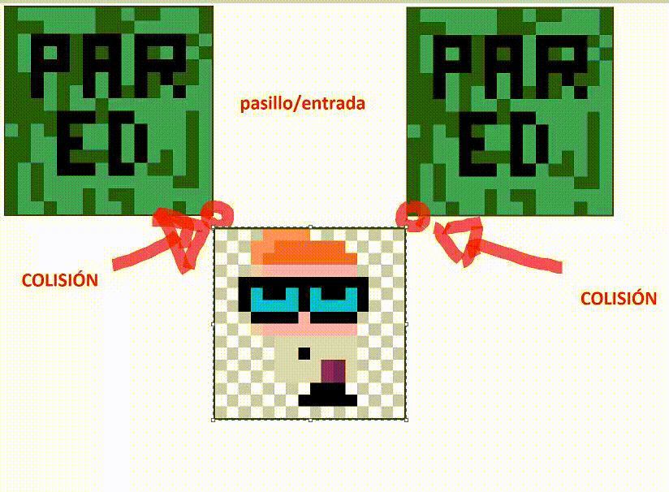
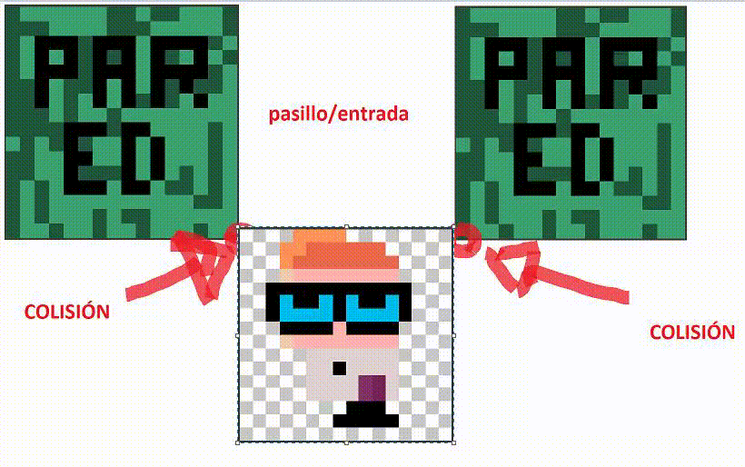

# Índice

- [Introducción](#notas-de-desarrollo)
- [Registro por semanas](#registro-semanal)
1. [Semana 1](#semana-del-06052024) 
   1. [Game Loop](#qué-es-un-game-loop)
   2. [¿Por qué es importante?](#por-qué-es-importante-el-bucle-de-juego)
   3. [Animaciones de personaje](#implementación-de-sprites-hechos-con-pixel-studio)
2. [Semana 2](#semana-del-13052024)
   1. [Editor de mapa](#editor-de-mapas-con-sprites)
   2. [Mejoras generales](#mejoras-generales)
   3. [Interpretador de mapa](#interpretador-de-mapa)
3. [Semana 3](#semana-del-20052024)
   1. [Desarrollo de centrado de cámara](#desarrollo-de-centrado-de-cámara)
   2. [Implementación de nuevos sprites](#implementación-de-nuevos-sprites)
   3. [Colisiones, sonidos y objetos](#implementación-de-colisiones)
   4. [Creación de objetos y posicionamiento](#creación-de-objetos-sprites-y-posicionamiento)
4. [Semana 4](#semana-del-27052024)
   1. [Optimización del código](#optimización-del-código)
___
# Notas de desarrollo

### En este documento estaré escribiendo los avances y registrandolos en una linea de tiempo

De esta manera tendré una visión más clara de como está avanzando el proyecto, intentaré estilizar este documento de la mejor manera posible para que sea comprensible, útil y simple.
Dicho esto, los objetivos de estas primeras semanas de desarrollo será investigar y programar los siguientes objetivos:
```
1. Un game loop.
2. Mostrar por pantalla al jugador.
3. Mostrar por pantalla el entorno.
4. Mostrar por pantalla objetos.
5. Controlar al jugador.
6. Programar las interacciones.
7. Implementar una base de datos
```
Para esto emplearé ***assets ya creados*** y, de ser necesario, modificaré los assets para adaptarlos a mi juego.
___
### ¿De qué va el juego (Teis)?

Mi idea es intentar desarrollar un juego en el que se pueda interactuar con varios objetos y personajes de un mismo mapa, dependiendo de como vaya el desarrollo,
implementaré otro mapa más allá del básico de inicio.
Este juego quiero que esté en Gallego y satirice un poco de los **"memes"** gallegos y de Vigo.
___
# Registro semanal
## Semana del 06/05/2024

*Definición de las propiedades de la pantalla mostrada al iniciar el juego:*
```java
//Propiedades pantalla
    private static final int maxScreenColumnas = 18;
    private static final int maxScreenFilas = 12;
    //Ancho y alto (uso valores mínimos por facilidad)
    private static final int screenWidth = TamañoFinal * maxScreenColumnas;
    private static final int screenHeight =  TamañoFinal * maxScreenFilas;


    public TeisPanel() {
        setPreferredSize(new Dimension(screenWidth,screenHeight));
        setBackground(Color.black);
        setDoubleBuffered(true);
    }
```

**Resultado:**


___
### Por otra parte...

1. Se crea un ***Issue*** y se relaciona al `PROJECT` creado en GitHub.
2. Se crea un *WebHook* con *Discord* para automatizar las actualizaciones del codigo como Logs a un canal de discord.
3. Se comienza a implementar el **Game Loop** en la rama *``ISSUE-1``*.
___
### ¿Qué es un Game Loop?

En desarrollo de `videojuegos` se conoce al "bucle principal del juego" o "Game Loop" como algo **increiblemente** fundamental:
Imagina que estás jugando a tu videojuego favorito. `Corres, saltas, esquivas enemigos y completas misiones.` Bien, pues *todo* esto está siendo posible gracias al _**Game Loop**_.

Pues volviendo a la pregunta principal, **qué es un Game Loop?**
Es la _base_ de la jugabilidad de un videojuego. Se trata de un ciclo que se repite constantemente mientras el juego está en funcionamiento, ``controlando el desarrollo de la partida y la experiencia del jugador``.
___
### ¿Cómo funciona el bucle de juego?
| Fases del bucle | Descripción                                                                                                                                                                                                                                                                          |                                                                                                                                                                                                                                                                        
|-----------------|--------------------------------------------------------------------------------------------------------------------------------------------------------------------------------------------------------------------------------------------------------------------------------------|
| ENTRADA         | El bucle comienza capturando las acciones del jugador, como *presionar botones, mover el joystick o usar la pantalla táctil*                                                                                                                                                         |
| PROCESAMIENTO   | Luego, el juego ``procesa`` estas entradas para determinar cómo *afectan el mundo del juego y el estado del jugador*. Por ejemplo, si presionas el botón de salto, tu personaje saltará en el juego.                                                                                 |
| ACTUALIZACIÓN   | Con base en las entradas procesadas, *el bucle actualiza el estado del juego*, incluyendo la posición de los objetos, la física del entorno y las variables del jugador ``(salud, munición, etc.)``.                                                                                 |
| RENDERIZADO     | Finalizando el ciclo, el bucle genera la `imagen` que se muestra en la pantalla, reflejando los cambios realizados en la etapa de actualización.                                                                                                                                     |
| REPETICIÓN      | El ciclo *vuelve* a comenzar, ``capturando nuevas entradas del jugador, procesándolas y actualizando el juego en consecuencia``. Este proceso se repite **incesantemente** mientras el juego esté en ejecución lo que consigue una experiencia fluida e interactiva para el jugador. |
___
### ¿Por qué es importante el bucle de juego?

Es fundamental por varias razones:

*Crea una experiencia fluida**: El bucle constante asegura que el juego responda instantáneamente a las acciones del jugador, proporcionando una sensación de control y realismo.

*Define la jugabilidad**: El bucle determina cómo se desarrolla la partida, estableciendo las reglas y la interacción del jugador con el mundo del juego.

*Mantiene el juego en marcha**: El ciclo repetitivo garantiza que el juego no se detenga ni se congele, manteniendo al jugador inmerso en la experiencia.

*Optimización**: El bucle permite optimizar el rendimiento del juego, ejecutando solo las tareas necesarias en cada ciclo y evitando procesos innecesarios.

En resumen, ``el bucle de juego`` es el corazón de un *videojuego, controlando la jugabilidad, la fluidez y la experiencia general del jugador*. Es un concepto fundamental para el diseño y desarrollo de videojuegos exitosos.
___
#### Definición de Game Loop:
Este metodo es llamado por el _GameLoop_ despues de otro llamado *"Actualiza"* (aun por definir).
**Instancia** un objeto para uso de gráficos de dos dimensiones y luego, a modo de prueba, ***defino un espacio en blanco situado
en las coordenadas ``x:100, y:100, alto y ancho: 48px``***.
```java
public void paintComponent(Graphics g){
    super.paintComponent(g);
    
    Graphics2D g2 = (Graphics2D)g;
    g2.setColor(Color.white);
    g2.fillRect(100,100,sizeFinal,sizeFinal);
    g2.dispose();
}
```

**Resultado:**


___
### Desarrollo de `Key Inputs`

Para desarrollar un _videojuego_ es **necesario** una serie de ``controles``. Esto es lo que estaré desarrollando en este apartado.
```java
@Override
public void keyPressed(KeyEvent e) {
    int code = e.getKeyCode();
    switch (code) {
        case KeyEvent.VK_W:
            up = true;
            break;
        case KeyEvent.VK_S:
            down = true;
            break;
        case KeyEvent.VK_A:
            left = true;
            break;
        case KeyEvent.VK_D:
            right = true;
            break;
    }
}
```
Al implementar este codigo en una clase llamada **GAME.FX.KeyManager** y luego programar que pasa al presionar cada tecla en el metodo **MOVE()**
````java
private void move() {
        if (key.up) {
            playerY -= speed;
        } else if (key.down) {
            playerY += speed;
        } else if (key.left) {
            playerX -= speed;
        } else if (key.right) {
            playerX += speed;
        }
    }
````

Lo que sucede es algo interesante y es que al iniciar la _app_ aparece la GUI.ventana en negro con el cuadrado blanco como se espera, ``PERO`` al presionar **WASD**,
este cuadrado parece _"desaparecer"_.

La explicación es la siguiente:
El GameLoop llama al metodo actualiza() que contiene el metodo move() lo *más rápido* que puede y **por ello** al actualizar el valor de la posicion
y luego hacer repaint, este valor se ve modificado todas las veces que el ordenador **es capaz de llamar a la función por segundo**.
Lo que haré para solucionar esto es ``CAPEARLO`` a _60 frames por segundo o menos_
___
### Definiendo el GameLoop a 30 fps...
El tiempo de ejecución es necesario capearlo para tener una sensación de fluidez y tener control sobre como se ejecutan los movimientos del juego.
Al buscar información sobre esto encontré un método popular sobre el **Game Loop llamado Delta Iterator**:
````java
@Override
public void run() {
    // Implementación Delta / Iterador Game Loop
    double tiempoEspera = (double) 1000000000/fps; // Calcula el tiempo de espera en nanosegundos por frame
    double delta = 0; // Variable para acumular el delta time
    long lastTime = System.nanoTime(); // Almacena el tiempo en nanosegundos del frame anterior
    long currentTime; // Variable para almacenar el tiempo en nanosegundos del frame actual

    // Implementación ShowFPS
    long timer = 0; // Variable para acumular el tiempo desde la última medición de FPS
    int espera = 0; // Contador de frames desde la última medición de FPS

    while (teisThread != null) { // Bucle principal del juego
        currentTime = System.nanoTime(); // Obtiene el tiempo en nanosegundos del frame actual
        delta += (currentTime - lastTime) / tiempoEspera; // Acumula el delta time (tiempo transcurrido desde el último frame)
        timer += (currentTime - lastTime); // Acumula el tiempo desde la última medición de FPS
        lastTime = currentTime; // Actualiza el tiempo del frame anterior con el tiempo actual

        if (delta >= 1) { // Si el delta time es mayor o igual a 1 (un frame completo)
            update(); // Llama al método `actualiza()` para actualizar el estado del juego
            repaint(); // Solicita que el componente se repinte (actualice su visualización)
            delta--; // Resta 1 al delta time para que no se acumule en el siguiente frame
            espera ++; // Incrementa el contador de frames
        }

        if (timer >= 1000000000) { // Si ha pasado un segundo (1000000000 nanosegundos)
            System.out.println("FPS: "+espera); // Imprime el valor de FPS (frames por segundo)
            espera = 0; // Reinicia el contador de frames
            timer = 0; // Reinicia el temporizador de FPS
        }
    }
}
````
_El resultado de asociar movimiento con sprites (aún en fase temprana) es el siguiente..._

Estos son los **sprites** creados:


_Este es el resultado de su **implementación**:_


___
### Animación mejorada
_Metodo move() de la clase GAME.ENTITY_

Nueva implementación: 1 sprite cada 8 frames:
- Ahora el metodo además de controlar la posición, tambien controla los sprites por movimiento.
- Este metodo está estructurado alrededor de la idea de ser ejecutado 30 veces POR CADA segundo.

Dentro de TeisPanel:
````java
public void update() {
        // Actualiza el estado del jugador
        model.getPlayer().actualiza();

        // Actualiza el estado del juego en el controlador
        controller.update();
    }
````
Dentro de Player *(es llamado por GameModel)*:
````java
public void move(KeyManager e) {
    /*
     * Este condicional comprueba que una tecla haya sido presionada para inicializar el stopNum a 0 o no.
     * Si sí que es presionado, se inicializa en 0 y no suma ningun valor a stopNum,
     * una vez hace eso pasa a comprobar que tecla ha sido presionada y actua en consecuencia.
     * Si no ha sido presionada ninguna tecla en el momento entonces stopNum incrementa.
    */
    if (e.up || e.down || e.left || e.right) {
        stopNum = 0;
        if (e.up) {
            worldY -= speed;
            sentido = 'w';
        } else if (e.down) {
            worldY += speed;
            sentido = 's';
        } else if (e.left) {
            worldX -= speed;
            sentido = 'a';
        } else {
            worldX += speed;
            sentido = 'd';
        }
        /*
         * Si stopNum es mayor a 1, el metodo pinta() de la clase player cambiara la imagen a la default (imagen stop).
         * El contador de Sprites ha de incrementar siempre para controlar el movimiento fluido para cualquier tipo
         * de movimiento.
         * */
        spriteCounter++;
        // Cada 10 frames el spriteNum varía
        if (spriteCounter > 8) {
            if (spriteNum == 1){
                spriteNum = 2;
            } else if (spriteNum == 2) {
                spriteNum = 1;
            }
            // Cada 10 frames los contadores son reseteados para que no incrementen al infinito y haya un control
            // sobre las animaciones a lo largo del tiempo de juego.
            spriteCounter = 0;
        }
    } else {
        sentido = '0'; // Valor elegido arbitrariamente por mi para que en el switch case llegue al case default.
        stopNum++;
    }
    if (stopNum > 15) {
        if (spriteNum == 1){
            spriteNum = 2;
        } else if (spriteNum == 2) {
            spriteNum = 1;
        }
        stopNum = 0;
    }
}
````
___
### Implementación de Sprites hechos con Pixel Studio
He usado Google Maps para ver cosas caracteristicas como las baldosas del suelo o como son las tapas de las alcantarillas
y basandome en eso y en la ayuda de un IA que pasa imagenes a PixelArt he logrado algunas imágenes interesantes logradas
con un programa llamado Pixel Studio.
1.  
2. 
___
## Semana del 13/05/2024
Esta semana ha sido complicada debido a que _decidí_ pornerme un reto a mayores:

- *Crear un editor de mapas*
  - *Que el editor pudiese guardar mapas*
  - *Que te permitiese decidir el tamaño del mapa*
  - *Que te permitiese cambiar el fondo por el sprite que quisieras*
___
### Editor de mapas con sprites
El editor funciona de la siguiente manera:

1. Un panel sobre el que pintar el mapa de cada nivel.
2. Un panel de sprites seleccionables.
3. Dos botones: uno de guardado y otro de generación de fondo.


Como se ve en este **gif** el editor pide al usuario que introduzca un número de ``filas y columnas``.
Luego, pasa a la *interfaz gráfica* como tal en la que hay 2 paneles y dos botones.
- ``El panel grande:`` ***sirve como plantilla para el mapa y es completamente modificable.***
- ``El panel de abajo:`` ***sirve como seleccionador de sprites.***
- Y, por último, los *botones* sirven para guardar el mapa o para poner un fondo con el bloque que esté seleccionado.


**Ejemplo de guardado:**


Para que el mapa pueda ser interpretado como una ``matriz de números`` hacen falta dos cosas:
- _Que los sprites sean traducidos a un numero asignado._
- _Generar el diccionario que dirá que numero corresponde a que cosa._

**Ejemplo de diccionario:**


___
### Mejoras generales
Ahora al iniciar el juego podrás seleccionar el mapa que quieres cargar y, además, las animaciones se han mejorado.
Ahora hay dos Sprites de movimiento, proximamente añadiré otros dos y el movimiento se verá mucho más fluido.

**Ejemplo mapa de prueba:**


___
### Interpretador de mapa
Para que el código pueda interpretar la matriz de números y traducirla a un mapa de Sprites hace uso del archivo generado
anteriormente por el Editor de Mapas llamado ``c_assets``.
El código realiza un leido de todas las filas y columnas del archivo y lo carga asignando a cada espacio su
correspondiente sprite de fondo.

**Está es la lógica detrás del leído de c_assets.txt y map.txt**
````java
public void loadMap(String mapName) {
        InputStream is;
        BufferedReader br;
        try {
            // Intenta obtener un InputStream para el archivo del mapa utilizando el classpath.
            is = getClass().getClassLoader().getResourceAsStream(mapName);
            if (is != null) {
                // Encuentra el archivo del mapa, procede a leerlo.
                br = new BufferedReader(new InputStreamReader(is));

                // Variables para controlar la columna (col) y la fila (fil) en el mapa.
                int col = 0, fil = 0;

                // Bucle hasta que tanto las columnas como las filas alcancen sus límites máximos.
                while (col < t.maxScreenColumnas && fil < t.maxScreenFilas) {

                    String linea = br.readLine();
                    // Bucle por cada elemento (separado por espacios) en la línea actual.
                    while (col < t.maxScreenColumnas) {
                        String[] mapID = linea.split(" ");
                        // Extrae el primer elemento (suponiendo que representa el ID del tipo de Pieza).
                        int map = Integer.parseInt(mapID[col]);
                        // Almacena el ID del tipo de Pieza en la posición correspondiente de mapaPiezaNum.
                        mapaPiezaNum[col][fil] = map;
                        col++;
                    }

                    // Reinicia la columna (col) e incrementa la fila (fil) para la siguiente línea.
                    if (col == t.maxWorldCol) {
                        col = 0;
                        fil++;
                    }
                }
                // Cierra el BufferedReader para liberar recursos.
                br.close();
            } else {
                // No se encontró el archivo del mapa.
                System.out.println("Error: ¡No se encontró el archivo del mapa '" + mapName + "'!");
            }
        } catch (IOException e) {
            // Maneja cualquier IOException que pueda ocurrir durante la lectura del archivo.
            System.out.println("Error: ¡Ocurrió un error al leer el archivo del mapa!");
            e.printStackTrace(); // Opcional: Imprime la traza de pila para depuración.
        }
    }
````
___
## Semana del 20/05/2024
### Desarrollo de centrado de cámara
Para desarrollar el centrado de cámara es necesario desarrollar **2 tipos de coordenadas**:
1. Coordenadas relativas al jugador
2. Coordenadas absolutas del mapa

En la anterior versión del código las columnas y las filas del mundo eran predeterminadas a 50 por lo que si un mundo
tenía menos o más entonces esta no sería renderizable por lo que he implementado una nueva clase:
````java
public class MapSize {
    public int maxCol;
    public int maxRow;
    public String fileName;

    public MapSize(int maxCol, int maxRow, String fileName) {
        this.maxCol = maxCol;
        this.maxRow = maxRow;
        this.fileName = fileName;
    }
}
````
Esta clase es empleado por un metodo de la clase **MapSelector** que devuelve una clase de tipo MapSize:
````java
public MapSize getMapSize() {
        String fileName = selectMap(); // Recoge el nombre del mapa llamando a otro metodo de la clase MapSelector
        InputStream is;
        BufferedReader br;
        int maxCol = 0, maxRow = 0;
        try {
            is = getClass().getClassLoader().getResourceAsStream(fileName);
            if (is != null) {
                br = new BufferedReader(new InputStreamReader(is));

                String linea;
                while ((linea = br.readLine()) != null) {
                    String[] mapID = linea.split(" ");
                    if (mapID.length > maxCol) {
                        maxCol = mapID.length;
                    }
                    maxRow++;
                }

                br.close();
            }
        } catch (IOException e) {
            //
        }

        return new MapSize(maxCol, maxRow, fileName);
    }
````
Este método es empleado en TeisPanel para determinar de primeras las dimensiones del mapa y pasar esos datos
a las subclases que emplean estos datos de ``largo y ancho``:
````java
// Constructor
    public TeisPanel() {
        // Selector de mapa
        MapSelector mapSelector = new MapSelector();
        MapSize datos = mapSelector.getMapSize();
        
        // Propiedades del mapa seleccionado
        maxWorldRow = datos.maxRow;
        maxWorldCol = datos.maxCol;
        worldWidth = sizeFinal * maxWorldCol;
        worldHeight = sizeFinal * maxWorldRow;
        // ...
        // Implementacion de backgrounds y mecanicas de colision
        PiezaManager piezaM = new PiezaManager(this, datos.fileName);
        //...
        this.controller = new GameController(model,piezaM);
    }
````
___
#### Varios arreglos realizados:
- Posicionamiento de los paneles de editor de mapa
- Nueva implementación: modo pincel
- JavaDoc y comentarios desarrollados
- Más securización y encapsulación del código
- Realizado código más limpio
- Arreglado bug de botones con el modo pincel
___
#### Implementación de nuevos Sprites
Para ir haciendo el mapa del juego principal, he creado varios sprites no siendo todos de 16x16:
*   
*  

Próximamente, estaré creando assets para el suelo y demás cosas... 
___
### Implementación de colisiones
Para que el juego tenga un sentido hacen falta ***INTERACCIONES*** ya sea con el entorno, con otros NPCs o con el propio
personaje mediante inventario o demás cosas.

El parametro que define si es colisionable o no una ``pieza`` será ``colision``. Para saber si se puede colisionar o no
un asset se distinguirá de la siguiente manera:

1. El diccionario **"c_assets.txt"** contendrá un asterisco al comienzo de aquellos sprites colisionables.
Ejemplo:
````text
19: Assets\background\sueloEstandarPlaza.png
*20: Assets\background\table01.png
````

Para realizar esto he decidido *cambiar* 2 cosas:
1. Ahora se generarán ***2 archivos*** de correspondencia de Sprites en vez de uno...
   1. ``c_assets.txt``
   2. ``c_assets_user.txt`` => Creado para mayor legibilidad de las correspondencias para el programador.
2. El filtrado de los Strings ya *no* se realizará desde ***PiezaManager*** sino desde el propio Editor de Mapas.

Esta es la clase SpriteLoader de EditorMap:
````java
public List<ImageIcon> loadSprites(String folderPath) {
   //...
   
   // Escribir la correspondencia entre el índice y la ruta de los sprites en un archivo de texto
   File file = new File("Assets/maps_correspondencia/c_assets_user.txt");
   if (!file.exists()) {
      try {
         file.createNewFile();
         // Escribir en el archivo de texto la correspondencia entre el índice y la ruta de los sprites
         writeToFile(sprites, imagePaths, file);
      } catch (IOException e) {
         // Ignorar la excepción
      }
   }
   
   file = new File("Assets/maps_correspondencia/c_assets.txt");
   if (!file.exists()) {
      try {
         file.createNewFile();
         // Escribir en el archivo de texto los sprites filtrados en orden para que luego el Juego no tenga que filtrar nombres
         writeToFileReal(sprites, imagePaths, file);
      } catch (IOException e) {
         // Ignorar la excepción
      }
   }
   
   //...
   return sprites;
}
````

Por otro lado, ``PiezaManager`` ya no realiza ningún filtrado de String:
````java
public String[] getImagePaths() {
   ArrayList<String> imagePaths = new ArrayList<>();
   
   try (BufferedReader reader = new BufferedReader(new FileReader("Assets/maps_correspondencia/c_assets.txt"))) {
      String line;
      while ((line = reader.readLine()) != null) {
          imagePaths.add(line.trim());
      }
   } catch (Exception e) {
      System.out.println(e.getMessage());
   }
   return imagePaths.toArray(new String[0]);
}
````
Además, ``PiezaManager`` distingue entre ``Piezas`` colisionables y no colisionables gracias a una nueva implementación
en el método ***getPiezaImage()***:
````java
public void getPiezaImage() {
   try {
      for (int i = 0; i < pieza.length; i++) {
          System.out.println(imagePaths[i]);
          if (imagePaths[i].startsWith("*")) {
              imagePaths[i] = imagePaths[i].substring(1);
              pieza[i] = new Pieza(true);
          } else {
              pieza[i] = new Pieza();
          }
          pieza[i].image = ImageIO.read(getClass().getClassLoader().getResourceAsStream(imagePaths[i]));
      }
   } catch (Exception e) {
      System.out.println(e.getMessage());
   }
}
````
Cabe mencionar que estos asteriscos *DE MOMENTO* se ponen a mano al ``COMIENZO`` de aquellos sprites que tengan que 
ser colisionables en el diccionario de correspondencia "c_assets.txt". 
El método ``getPiezaImage()`` realiza una instanciación de Piezas colisionables pasando un boolean por parametro al
constructor parametrizado de ``Pieza``:
````java
public class Pieza {
   // Atributos
   public BufferedImage image;
   public boolean colision = false;
   
   public Pieza(boolean b) {
     colision = b;
   }
   public Pieza(){}
}
````

#### Explicación de la colisión del PJ:
Lo fácil sería delimitar todo el sprite del PJ colisionable de tal manera que el cuadrado completo que ocupa el sprite del
PJ sería colisionable.
Bien, esto produce un *problema de jugabilidad* muy grave que es el hecho de que para no colisionar, el área de colisión
el cual es un cuadrado, ``no puede tocar en ninguno de sus bordes`` al área de colisión del PJ que también es un cuadrado de mismo tamaño.

Véase este ejemplo con un sprite de Dexter:
*Cuando Dexter intenta entrar de manera orgánica por el pasillo siempre le cuesta dado a que uno de sus bordes
``casi siempre`` toca con el área colisionable de la pared, que es su totalidad*.



Cuando por fin logra entrar es cuando ninguno de sus bordes toca nada:



#### El código desarrollado para las colisiones es el siguiente:
Para solucionar estos problemas, ahora tanto la clase padre Entity como su clase hija ``Player`` cuentan 
con los siguientes atributos:
````java
public Rectangle solidArea;
public int defaultSolidAreaX, defaultSolidAreaY;
public boolean collisionOn = false;
````
Estos atributos definen el área de colisión de las entidades. Para comprobar las colisiones entre objetos, piezas y 
demás cosas colisionables se crea una clase llamada ``CollisionCheck`` cuyo método más importante es el siguiente:
````java
public void checkPieza(Entity entity) {
    //...

    // Verifica la dirección de la entidad y calcula las piezas correspondientes
    switch (entity.sentido) {
        case 'w': // Arriba
            //...
            if (teisPanel.controller.getPiezaManager().pieza[pieza1].colision || teisPanel.controller.getPiezaManager().pieza[pieza2].colision) {
                entity.collisionOn = true;
            }
            break;
        case 's': // Abajo
            //...
            if (teisPanel.controller.getPiezaManager().pieza[pieza1].colision || teisPanel.controller.getPiezaManager().pieza[pieza2].colision) {
                entity.collisionOn = true;
            }
            break;
        case 'a': // Izquierda
            //...
            if (teisPanel.controller.getPiezaManager().pieza[pieza1].colision || teisPanel.controller.getPiezaManager().pieza[pieza2].colision) {
                entity.collisionOn = true;
            }
            break;
        case 'd': // Derecha
            //...
            if (teisPanel.controller.getPiezaManager().pieza[pieza1].colision || teisPanel.controller.getPiezaManager().pieza[pieza2].colision) {
                entity.collisionOn = true;
            }
            break;
    }
}
````
En términos simples, comprueba si los siguientes **2 bloques** que pisará la entidad son colisionables o no, de ser el caso,
entonces evitará que pueda caminar a esa dirección. Dicho de otra manera, se predice a donde irá la entidad
en base a su dirección y desplazamiento.

La variable ``entity.collisionOn`` se usa de la siguiente manera en ``Player``:
````java
public void move(KeyManager e, TeisPanel teisPanel) throws LineUnavailableException {
    //...

    // Si no hay colisión, mueve al jugador
    if (!collisionOn) {
        movePlayer(sentido);
    }
    
    //...
}
````
Si no hay colisión, el jugador se puede mover en ese *sentido*.

Resultado de la implementación en un mapa de prueba:


___
### Creación de Objetos (Sprites) y posicionamiento
Ahora existen 3 tipos de clases: ``ObjectGame, ObjectPlacer y Objects`` como tal:

**Object Game** cuenta con los siguientes atributos...
````java
public BufferedImage image;
public String id;
public boolean collision = false;
public int worldX, worldY;
public int height = 48;
public int width = 48;

// El objeto entero será el área de colisión
public Rectangle solidArea = new Rectangle(0,0, width, height);
````
Estos atributos sirven para la representación gráfica del objeto como para la identificación del mismo cuando el jugador
hace contacto con estos. De esta manera, también se instancia ``Rectangle`` que determina una área colisionable.

**Object Placer** cumple con la función de instanciar y posicionar objetos en el mapa.
````java
public void setObject() {
        // Crea un objeto Passvigo y lo coloca en la posición (23, 23)
        teisPanel.obj[0] = new Passvigo();
        teisPanel.obj[0].worldX = 20 * teisPanel.sizeFinal;
        teisPanel.obj[0].worldY = 15 * teisPanel.sizeFinal;

        // Crea un objeto Puerta y lo coloca en la posición (20, 21)
        teisPanel.obj[1] = new Puerta();
        teisPanel.obj[1].worldX = 10 * teisPanel.sizeFinal;
        teisPanel.obj[1].worldY = 15 * teisPanel.sizeFinal;

        // Crea un objeto Cofre y lo coloca en la posición (20, 21)
        teisPanel.obj[2] = new Container();
        teisPanel.obj[2].worldX = 15 * teisPanel.sizeFinal;
        teisPanel.obj[2].worldY = 15 * teisPanel.sizeFinal;
    
        // Crea un objeto Cofre y lo coloca en la posición (20, 21)
        teisPanel.obj[3] = new BusVitrasa();
        teisPanel.obj[3].worldX = 20 * teisPanel.sizeFinal;
        teisPanel.obj[3].worldY = 10 * teisPanel.sizeFinal;
}
````
Como se ve en el ejemplo, cada objeto se instancia sobre una lista de TeisPanel de tipo ObjectGame.
Esto es gracias a que cada objeto (BusVitrasa, Container, etc) se extienden de una clase padre
siendo esta ``ObjectGame``.

Cada objeto sigue un tipo de clase similar:
````java
public class BusVitrasa extends ObjectGame {

    public BusVitrasa() {
        // Establece el identificador del Passvigo
        id = "Bus";
        // Carga la imagen del Passvigo desde un archivo de recursos
        try {
            image = ImageIO.read(getClass().getClassLoader().getResourceAsStream("objects/busVitrasa.png"));
            height = image.getHeight() * 7;
            width = image.getWidth() * 7;
            solidArea.width = width;
            solidArea.height = height;
        } catch (IOException e) {
            // Si ocurre un error al cargar la imagen, lanza una excepción RuntimeException
            throw new RuntimeException(e);
        }
    }
}
````
En este caso, la clase Bus se identifica de las demas por tener un id llamado "Bus" y también modifica su tamaño.
Los objetos son creados en el juego de la siguiente manera:
````java
public ventana() {
    teisPanel = new TeisPanel(); // Crea un nuevo panel principal
    setDefaultCloseOperation(EXIT_ON_CLOSE); // Establece la operación por defecto al cerrar la ventana
    setResizable(false); // Impide que la ventana sea redimensionable
    setTitle("Teis"); // Establece el título de la ventana
    add(teisPanel); // Agrega el panel principal a la ventana
    pack(); // Ajusta el tamaño de la ventana para que quepa el panel principal
    setLocationRelativeTo(null); // Centra la ventana en la pantalla
    setVisible(true); // Hace visible la ventana

    // Inicializa los items del mapa
    teisPanel.setUpItems();

    // Inicializa el hilo principal del juego
    teisPanel.startTeisThread();
}
````
Se llama a un método que llama a setUpItems() el cual se encarga de inicializar la Lista de Objetos.
___
### Implementación de efectos de sonido

Nueva clase: Sound y nuevos assets/effect ademas de cambios setUpItems y GameController.

Falta por añadir algún tipo de menu que controle el nivel de volumen del juego. Es decir, un menú. 

Se crea la clase Sound cuya función se basa en recoger archivos de audio **wav 16bit** y reproducirlos:
````java
public class Sound {
    Clip clip;
    URL[] soundPath = new URL[10];
    
    public Sound() {
        // Se establecen los paths de los archivos de sonido en el arreglo soundPath.
        soundPath[0] = getClass().getClassLoader().getResource("effects/chillbeat.wav");
        soundPath[1] = getClass().getClassLoader().getResource("effects/recogeobjetos.wav");
        soundPath[2] = getClass().getClassLoader().getResource("effects/normalito.wav");
    }
    
    public void setFile(int i) throws LineUnavailableException {
        try {
            // Se crea un AudioInputStream a partir del archivo de sonido seleccionado.
            AudioInputStream ais = AudioSystem.getAudioInputStream(soundPath[i]);
            // Se crea un Clip de audio y se abre con el AudioInputStream.
            clip = AudioSystem.getClip();
            clip.open(ais);
        } catch (UnsupportedAudioFileException | IOException e) {
            // Se lanza una excepción RuntimeException si ocurre un error al abrir el archivo de sonido.
            throw new RuntimeException(e);
        }
    }

    // Setters y getters...
}
````
Esta clase luego se emplea en el ``GameController`` que instancia 2 clases Sound, una para controlar la música de fondo
y otra para controlar efectos de sonido especificos como por ejemplo el de recoger objetos o abrir puertas:
````java
public class GameController {
    //...
    // Efectos de sonido
    Sound sound = new Sound();
    Sound se = new Sound(); // SoundEffect
    //...
    public Sound getSound() {
        return sound;
    }
    public void update() throws LineUnavailableException {
        // Actualiza el estado del jugador
        model.actualiza();
    }
    public void playMusic(int i) throws LineUnavailableException {
        sound.setFile(i);
        sound.play();
        sound.loop();
    }
    public void stopMusic() {
        sound.stop();
    }
    public void playSelection(int i) throws LineUnavailableException {
        se.setFile(i);
        se.play();
    }
    public void stopSelection(int i) throws LineUnavailableException {
        se.setFile(i);
        se.stop();
    }
}
````
La implementación de este método con las interacciones del jugador con los objetos se ven en el método de Player
en el que dependiendo de que objeto toque el jugador, una acción será ejecutada:
````java
public void pickUpItem(int id) throws LineUnavailableException {
    if (id != 999) { // Verifica si el objeto existe
        // Verifica el tipo de objeto y realiza la acción correspondiente
        switch (teisPanel.obj[id].id) {
            case "Passvigo":
                teisPanel.controller.playSelection(1);
                teisPanel.obj[id] = null; // Elimina el objeto del mapa
                tenPass = true; // True si tienes las PassVigo
                teisPanel.controller.ui.showMessage("tes a PassVigo, poderás entrar ó Vitrasa... qué merda");
                break;
            case "Puerta":
                // Verifica si el jugador tiene PassVigo
                if (tenPass) {
                    teisPanel.obj[id] = null;
                    /*tenPass = false;*/
                }
                break;
            case "Container":
                teisPanel.controller.ui.isFinished = true;
                if (teisPanel.controller.getSound().getClip() != null)
                    teisPanel.controller.stopMusic();
                teisPanel.controller.playSelection(2);
                break;
        }
    }
}
````
___
## Semana del 27/05/2024
### Optimización del código
Gracias al método `System.nanoTime()` se pueden conocer instantes de tiempo con precisión de nanosegundos, sabiendo esto
y viendo como está el código hecho me doy cuenta de que en el loop de pintado hay instancias que se pueden evitar.
Con el código original, *mi ordenador* tarda unos ~650000 nanosegundos en pintar las piezas.

Esto se puede saber aplicando ``System.nanoTime()`` de la siguiente manera:
````java
public void paintComponent(Graphics g){
    //...
    // Tiempo que tarda en dibujar:
    long tDraw = 0;
    if (model.keyManager.Time)
        tDraw = System.nanoTime();
    //...
    if (model.keyManager.Time) {
        long tDrawEnd = System.nanoTime();
        long tiempoRestante = tDrawEnd - tDraw;
        System.out.println("Tiempo de pintado" + tiempoRestante); // Printea por pantalla el tiempo transcurrido
    }
    //...
}
````
Creo una ``nueva clase: PiezaUtils`` con la idea de re-escalar las imágenes antes de dibujarlas por pantalla,
de esta manera, el loop de juego no tendrá que re-escalar la imágen cada vez que llama a la variable **imágen**:
````java
public class PiezaUtils {
    public BufferedImage escalado(BufferedImage origin, int width, int height) {
        // Crea una nueva BufferedImage con las dimensiones deseadas y el mismo tipo que la imagen original
        BufferedImage escalado = new BufferedImage(width, height, origin.getType());

        // Crea un objeto Graphics2D para dibujar la imagen
        Graphics2D g2 = escalado.createGraphics();

        // Dibuja la imagen original en la nueva BufferedImage, escalándola a las dimensiones deseadas
        g2.drawImage(origin, 0, 0, width, height, null);

        // Libera los recursos del objeto Graphics2D
        g2.dispose();

        // Devuelve la imagen escalada
        return escalado;
    }
}
````
Otro cambio realizado ha sido el de como se generan las Piezas. Antes, estas eran instanciadas y luego escaladas,
ahora todo se hace desde un metodo llamado ``setEscaled()``. Este método se encarga de la generación de Piezas
y del reescalado de las imágenes para adaptarlas a la resolución por defecto de los sprites que es de **48x48px**.
````java
public void getPiezaImage() {
    for (int i = 0; i < pieza.length; i++)
        setEscaled(i);
}
public void setEscaled(int i) {
    // Crea un nuevo objeto PiezaUtils
    PiezaUtils piezaUtils = new PiezaUtils();
    try {
        // Verifica si la ruta de la imagen comienza con un asterisco
        if (imagePaths[i].startsWith("*")) {
            // Elimina el asterisco de la ruta de la imagen
            imagePaths[i] = imagePaths[i].substring(1);
            // Crea un nuevo objeto Pieza con la bandera isMirrored establecida en true
            pieza[i] = new Pieza(true);
        } else {
            // Crea un nuevo objeto Pieza con el constructor predeterminado
            pieza[i] = new Pieza();
        }

        // Lee la imagen desde el recurso especificado por la ruta de la imagen
        pieza[i].image = ImageIO.read(getClass().getClassLoader().getResourceAsStream(imagePaths[i]));

        // Escala la imagen al tamaño deseado (48x48 píxeles) utilizando el método escalado de PiezaUtils
        pieza[i].image = piezaUtils.escalado(pieza[i].image, 48, 48);
    } catch (IOException e) {
        // Imprime el mensaje de error si ocurre una excepción al leer la imagen
        System.out.println(e.getMessage());
    }
}
````
#### Por otro lado...
Las clases ``Entity y Player`` están más diferenciadas que antes, ya que el método encargado del dibujado de los sprites
del jugador ahora están en ``Player`` como debería haber estado desde un principio.
````java
public void getPlayerImage() {
    up1 = setPlayerSprite("player/upWalkingBehind1.png");
    up2 = setPlayerSprite("player/upWalkingBehind2.png");
    down1 = setPlayerSprite("player/downWalking1.png");
    down2 = setPlayerSprite("player/downWalking2.png");
    left1 = setPlayerSprite("player/leftWalking1.png");
    left2 = setPlayerSprite("player/leftWalking2.png");
    right1 = setPlayerSprite("player/rightWalking1.png");
    right2 = setPlayerSprite("player/rightWalking2.png");
    stop = setPlayerSprite("player/frontStanding.png");
    stop2 = setPlayerSprite("player/stop2.png");
}
public BufferedImage setPlayerSprite(String path) {

    PiezaUtils piezaUtils = new PiezaUtils();
    BufferedImage image;
    try {
        image = ImageIO.read(getClass().getClassLoader().getResourceAsStream(path));
        image = piezaUtils.escalado(image,48,48);
    } catch (IOException e) {
        throw new RuntimeException(e);
    }
    return image;
}
````
#### Además...
La clase que maneja los objetos (`ObjectGame`) ahora instancia también la clase de `PiezaUtils` para que las clases
heredadas como `Container` y las demás hereden esta misma. De esta manera, la imágen de cada objeto es escalada antes 
de ser pintada mediante un paintComponent.

**Después de todas estas modificaciones el tiempo de carga ha bajado a: ~200000 nanosegundos**.
___
### Diálogos

#### Dependencia de fuente de texto

### Pantalla de carga

### Eventos complejos y Cooldowns de los mismos

### Reestructuración del código

ObjectGame ya no existe, ahora todos los objetos son clases heredadas de Entity.

TeisPanel tiene otra forma de dibujar la pantalla ya que el método paintComponent ha sido mejorado considerablemente:
1. Reducir la cantidad de iteraciones: En lugar de iterar sobre los arrays controller.npc y controller.obj para agregar elementos a controller.entities, puedes utilizar Arrays.stream() para agregar todos los elementos no nulos en una sola línea.
2. Utilizar métodos para agrupar lógica: El método paintComponent está haciendo demasiadas cosas. Puedes crear métodos separados para dibujar el fondo, dibujar las entidades, dibujar la interfaz de usuario, etc. Esto hará que el código sea más fácil de leer y mantener.
3. Evitar crear objetos innecesarios: En lugar de crear un nuevo Graphics2D objeto cada vez que se llama a paintComponent, puedes reutilizar el objeto Graphics pasado como parámetro.
4. Reducir la cantidad de llamadas a métodos: En lugar de llamar a controller.entities.get(i).draw(g2) en cada iteración, puedes crear una variable local para almacenar la entidad actual y llamar a su método draw solo una vez.

````java
public void paintComponent(Graphics g) {
      super.paintComponent(g);
      Graphics2D g2 = (Graphics2D) g;
      //...
      if (controller.estado == controller.cargaState) {
         // Dibuja la pantalla de carga.
         controller.ui.draw(g2);
      } else {
         // Dibuja el fondo.
         drawBackground(g2);
      
         // Dibuja las entidades.
         drawEntities(g2);
      
         // Dibuja la interfaz de usuario.
         controller.ui.draw(g2);
      }//...
      // Libera los recursos gráficos.
      g2.dispose();
}
````

Los métodos drawBackground y drawEntities:
````java
private void drawBackground(Graphics2D g2) {
   // Dibuja el fondo utilizando el objeto PiezaManager.
   controller.getPiezaManager().pinta(g2);
}
private void drawEntities(Graphics2D g2) {
   // Limpia la lista de entidades.
   controller.entities.clear();
   
   // Agrega las entidades no nulas a la lista de entidades.
   controller.entities.addAll(Arrays.stream(controller.npc).filter(Objects::nonNull).toList());
   controller.entities.addAll(Arrays.stream(controller.obj).filter(Objects::nonNull).toList());
   controller.entities.add(model);
   
   // Ordena las entidades por su posición en Y.
   controller.entities.sort(Comparator.comparingInt(e -> e.worldY));
   
   // Dibuja cada entidad en la lista.
   for (Entity entity : controller.entities) {
      entity.draw(g2);
   }
   
   // Limpia la lista de entidades.
   controller.entities.clear();
}
````

Explicación:
1. Arrays.stream(controller.npc) crea un flujo de datos a partir del array controller.npc.
2. filter(Objects::nonNull) filtra el flujo de datos y solo permite pasar los elementos no nulos.
3. toList() convierte el flujo de datos en una lista y se agrega a la lista controller.entities utilizando el método addAll().
4. Se repite el proceso para el array controller.obj.
5. Finalmente, se agrega la entidad model a la lista controller.entities utilizando el método add().

### IDEAS para los NPCs e Easter Eggs
#### Idea de uso de la passVigo y las passVigoPLUS:
Molaría poner que la PassVigo tiene X saldo dando resultado a que...
* puedes abrir X número de puertas dependiendo del saldo que tengas.
* Con las PassVigoPLUS puedes acceder a un easter egg, donde luchas contra el dinoseto, estaría guapísimo.
* Por casa uso de la PassVigo, notificación en la pantalla sobre cuanto saldo queda.

#### Ideas para más NPCs
Abres un contenedor que pone VIGO CIUDAD MÁS LIMPIA DE EUROPA y:
* lo único que encuentras es "outra botella de mayerlin baleira, outra vez será..."
* encuentras una botella de mayerlin llena "Deus está a sorrirche, hoxe touca Churru sí ou non sí...(?)"

Encuentras un Item que parece una cajetilla en el suelo tirado... "haberá biruta?":
* está vacío "Deus da ós seus mellores guerreiros as peores das batallas (touca ir ó estanco, manin)"
* tiene algún que otro cigarro "Sorride, que hoxe non se o pides a tua nai!"

Encuentras un periodico en el suelo:
* lo recoges y el titular pone "O Celta volveu a perder...", "ai... a combinada, qué mala sorte que ten sempre este equipo!".
* lo recoger y el titular pone "O Celta gañou!", "*Simplemente non cho cres e segues coa tua vida*".

Bebes de una botella que te da un NPC:
* "bebiches da botella dun bo home do naútico, agora ves sonidas e escoitas cores"

Un vieixo de dubidosa procedencia non deixate pasar pola porta:
* "Un viello de dubidosa procedencia non deixate pasar ainda despois de pedirlle amablemente que faga o favor de moverse, terás que tomar a xustiza pola tua man"

Un fulano de Ourense pregunta que donde está la máquina de tabaco más cercana:
* "O acabas de mandar pra o Vialia (encóntraste en Teis), eres o mal en persoa"

#### IDEOTE PARA UN NPC
Que sea un viejo con arapos que si te acercas y le das al botón "E" de interactuar,
te suelte diálogos (que se pueden grabar y soltar a la vez que el texto) como 
* "chorvo, sabes que din dos pimentitos de padrón??????"
* "uns pican... e outros non *risa jodidamente incontenible*"

Ejemplo:
-  ==> La parca de Bill y Mandy
-  ==> Finn y Jake
-  ==> Pedro Sánchez: entregandote una carta a la ciudadania